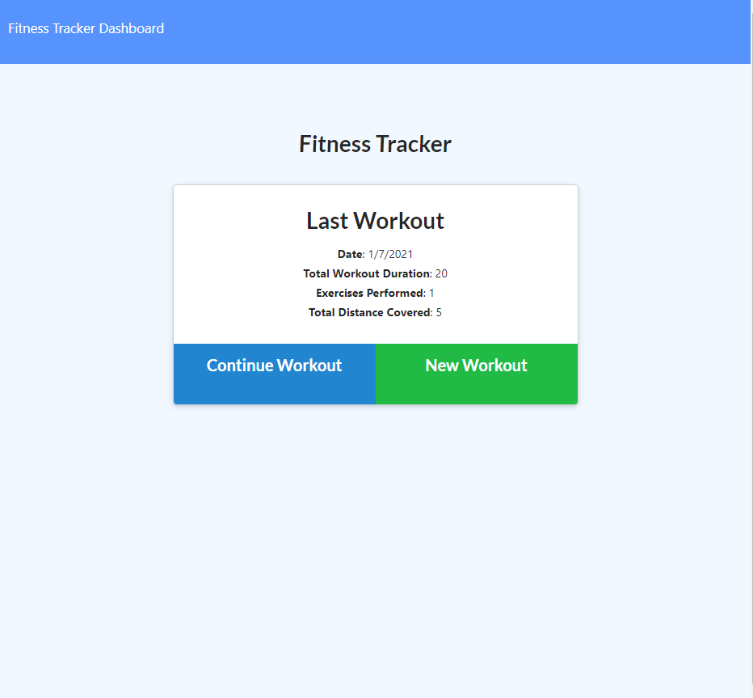
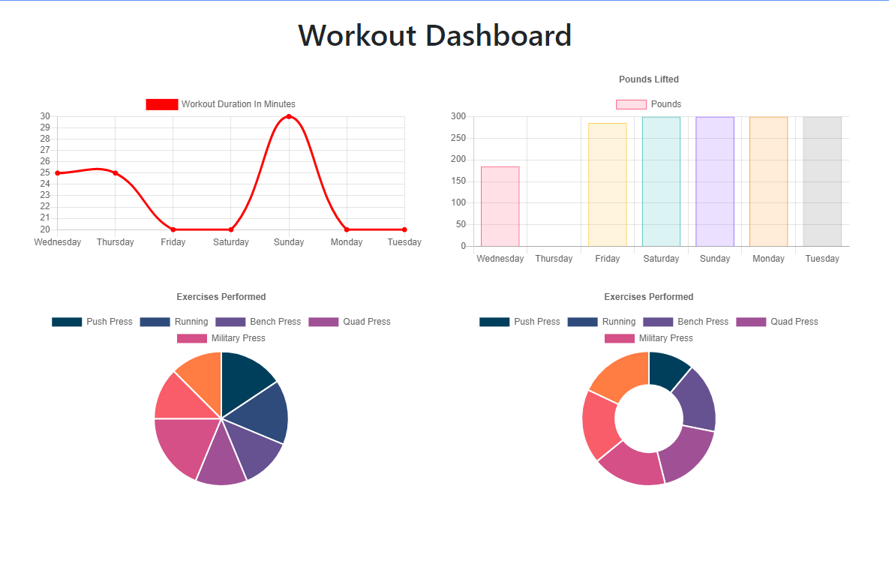

# Fitness Tracker

## Table Of Contents
<!-- click each bullet to move to the associated section -->
* [Description](#description)
* [Install](#install)
* [Usage](#usage)
* [Contribute](#contribute)
* [Take A Look](#take-a-look)
* [License](#license)
* [Questions](#questions)
## Description

Easily add workouts and track your progress! Enter the details of the workout and it will be graphed for your review on the dashboard!

## Install

Simply visit the link provided [here!](https://fitness-tracker2.herokuapp.com/?id=5ff7dfcfdf096400172b09f3)

## Usage

Used for inputting workout stats and transforming it into easy-to-read data for tracking progression.

## Take A Look

## License

This application is covered under MIT License.
Copyright 2021 Zachary Favela
       
        Permission is hereby granted, free of charge, to any person obtaining a copy of this software and associated documentation files (the "Software"), to deal in the Software without restriction, including without limitation the rights to use, copy, modify, merge, publish, distribute, sublicense, and/or sell copies of the Software, and to permit persons to whom the Software is furnished to do so, subject to the following conditions:
        
        The above copyright notice and this permission notice shall be included in all copies or substantial portions of the Software.
        
        THE SOFTWARE IS PROVIDED "AS IS", WITHOUT WARRANTY OF ANY KIND, EXPRESS OR IMPLIED, INCLUDING BUT NOT LIMITED TO THE WARRANTIES OF MERCHANTABILITY, FITNESS FOR A PARTICULAR PURPOSE AND NONINFRINGEMENT. IN NO EVENT SHALL THE AUTHORS OR COPYRIGHT HOLDERS BE LIABLE FOR ANY CLAIM, DAMAGES OR OTHER LIABILITY, WHETHER IN AN ACTION OF CONTRACT, TORT OR OTHERWISE, ARISING FROM, OUT OF OR IN CONNECTION WITH THE SOFTWARE OR THE USE OR OTHER DEALINGS IN THE SOFTWARE.
## Questions

For more content, check out my [GitHub](https://github.com/ZacharyBinx)!

Any questions regarding this project can be sent to ZacharyBinxGit@gmail.com and I will respond as soon as reasonably possible.
